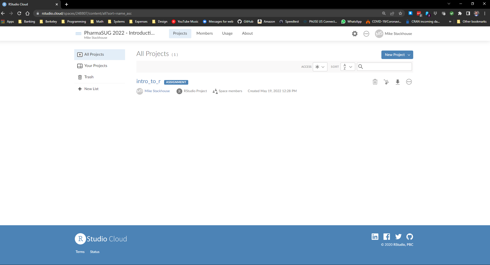
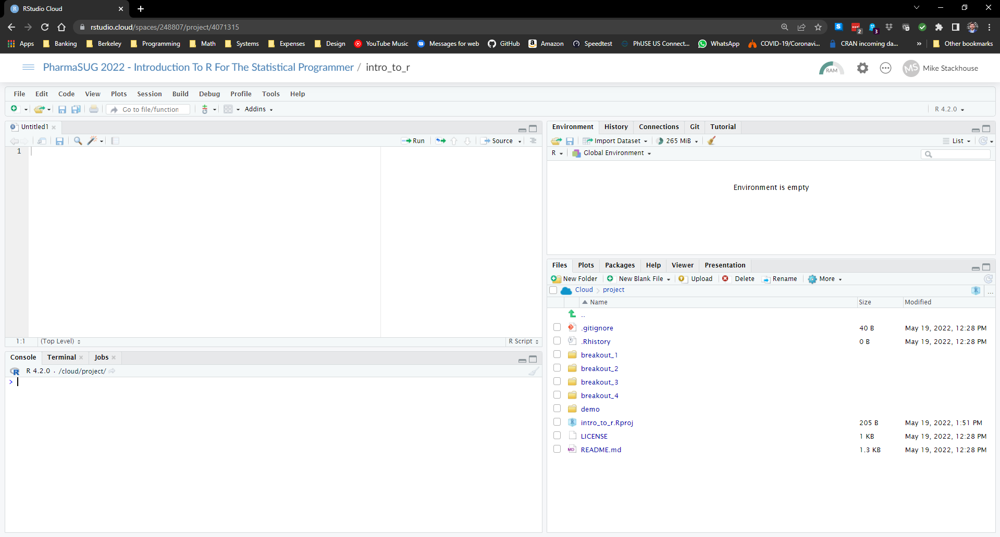

   
## The Cloud

During the workshop we will be using RStudio Cloud. The benefit of this is we can all use R with the same configurations, rather than setting up R on each operating system.

You can find the project associated with the workshop here: https://rstudio.cloud/spaces/248807/project/4071315. Once logged in, you should see the intro_to_r project:

</img>

Clicking on the project will open an RStudio Session. This is what we will be using to program for the entirety of the course

</img>

